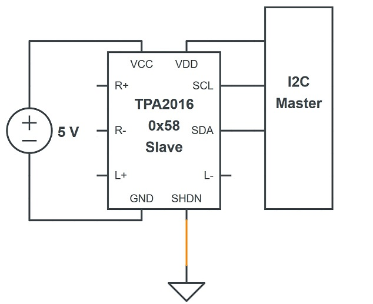

# TPA2016D2 Library for Linux

<!-- TOC depthFrom:2 depthTo:6 withLinks:1 updateOnSave:1 orderedList:0 -->

- [Features](#features)
- [Wiring and testing I2C](#wiring-and-testing-i2c)
- [Compilation](#compilation)
	- [Install dependencies](#install-dependencies)
	- [Make and install](#make-and-install)
	- [Launch tests (optional)](#launch-tests-optional)
- [Usage](#usage)

<!-- /TOC -->

## Features

This library is originally a port of this [Arduino library](https://github.com/adafruit/Adafruit-TPA2016-Library) which removes Arduino dependencies.

I've taken this great library and added :
* Reading of values
* Configuration of all possible parameters
* Natural configuration (*i.e* "put the maximum gain to 30dB" rather than "put the maximum gain to the value found in the reference manual conversion table")
* Cross-conditions checks (*e.g.* cannot disable limiter while compression ratio is not 1:1)
* Tests of the library and of the amplifier itself

## Wiring and testing I2C

In order to use and test the library, you need to successfully connect to the amplifier through an I2C adapter.

The wiring is very simple : just connect SDA, SCL and VCC to the appropriate data, clock and power pin of your I2C adapter, as shown below.



Also, before testing, we recommend to **reset your amplifier registers** at their default value, by forcing `SHDN` pin to `0` (active low). This is the orange wire above. Don't forget to remove the wire before using the amplifier, otherwise it will just not work at all.

To confirm that the amplifier is well detected, you can try the following commands :
```bash
# Check which I2C adapters are available
$ i2cdetect -l
[...]
i2c-1   i2c             OMAP I2C adapter                        I2C adapter
[...]
```

So I'll use `/dev/i2c-1` on my machine.

```bash
# Check which I2C devices are detected on adapter 1
$ i2cdetect -y -r 1
0  1  2  3  4  5  6  7  8  9  a  b  c  d  e  f
00:          -- -- -- -- -- -- -- -- -- -- -- -- --
10: -- -- -- -- -- -- -- -- -- -- -- -- -- -- -- --
20: -- -- -- -- -- -- -- -- -- -- -- -- -- -- -- --
30: -- -- -- -- -- -- -- -- -- -- -- -- -- -- -- --
40: -- -- -- -- -- -- -- -- -- -- -- -- -- -- -- --
50: -- -- -- -- -- -- -- -- 58 -- -- -- -- -- -- --
60: -- -- -- -- -- -- -- -- -- -- -- -- -- -- -- --
70: -- -- -- -- -- -- -- --
```

As you can see, the I2C device with address `0x58` is detected on bus 1. This is our amplifier.

```bash
# Dump byte 1-7 of I2C device at addresse 0x58 on adapter 1
$ i2cdump -y -f -r 1-7 1 0x58
     0  1  2  3  4  5  6  7  8  9  a  b  c  d  e  f
00:    23 05 0b 00 1c 7f c1                          
```

We are able to read the registers, so all right, we can use the library.

## Compilation

### Install dependencies
* `libi2c-dev`
* [Catch2](https://github.com/catchorg/Catch2) for testing (*optional*)

### Make and install

To build and install the library as a shared library, just type :
```bash
$ make
$ sudo make install
```

### Launch tests (optional)

There is two type of tests :
* Library tests, *i.e.* unit and integration tests. **None of them** should fail. To launch them, just type :
```bash
$ make test_lib
```
* Amplifier tests, which check that the default values reported by the amplifier are the ones reported in the [reference manual](https://www.ti.com/product/TPA2016D2/technicaldocuments) (page 24 and so on). Some tests could fail, and **this is ok**, this just means that you should not expect the default values written in EEPROM to be the manual's one. To launch them, just type :
```bash
$ make test_defaults
```

## Usage

Import `I2C_TPA2016.h` in your program. Compile with `-ltpa2016` flag or add it to your Makefile `LDFLAGS` variable.

**Warning** : in the past, all smbus calls were defined in headers, but newer versions are in a shared library. You may have to compile your program with `-li2c` flag.

Sample usage :
```c++
#include <I2C_TPA2016.h>
int main(int argc, char const *argv[]) {
  // Open I2C on bus number 1
  I2C_TPA2016 tpa(i2c_bus);
  // Disable left channel
  tpa.enableChannels(true, false);
  // Set gain to 25dB
  tpa.setGain(25);
  // Disable compression
  tpa.setCompressionRatio(TPA2016_COMPRESSION_RATIO::_1_1);
  // Disable limiter
  tpa.enableLimiter(false);
  return 0;
}
```

The complete API reference can be found [in the documentation](doc/api.md).

**Warning** : Register writes persist until power turns off. So, if you disable a channel and forget to enable it again, you could think the amplifier is broken. It is therefore a better idea to explicitly set the register values when running your program.
